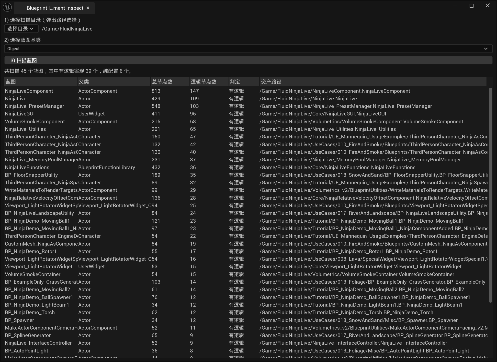

# Blueprint Implement Inspect

一个 Unreal Engine 编辑器插件，用于扫描指定目录下的蓝图资产，检测每个蓝图是否包含可执行的图表逻辑，并以列表形式展示节点数量统计信息。



---

## 功能特性

- **目录选择**：通过弹出式路径选择器，选定要扫描的 Content 目录（支持子目录递归扫描）
- **基类筛选**：选择蓝图基类（支持 UObject、UserWidget 等任意抽象类），仅扫描该类的派生蓝图
- **异步扫描**：扫描任务在编辑器主线程上分帧执行（每帧处理 10 个资产），不阻塞编辑器操作
- **进度条显示**：扫描过程中实时显示进度，支持随时取消
- **节点统计**：统计每个蓝图的总节点数及逻辑节点数（含连接了执行引脚的节点）
- **逻辑判定**：将蓝图标记为"有逻辑"或"纯配置"
- **父类显示**：列表中显示每个蓝图的直接父类名称
- **列排序**：点击"总节点数"或"逻辑节点数"列表头可升序/降序排列
- **定位资产**：点击列表中的任意蓝图行，自动在 Content Browser 中定位并高亮该资产
- **LLM文本导出**：选中扫描结果中的蓝图后，可复制或保存完整蓝图文本，包含类信息、接口、变量、CDO默认值、图表、函数、节点、引脚连接和接近 Ctrl+C 的节点文本

---

---

## 使用方法

### 打开插件窗口

插件窗口可通过以下三种方式打开：

| 入口 | 路径 |
|------|------|
| 菜单栏 | **工具（Tools）** → Blueprint Implement Inspect |
| 菜单栏 | **窗口（Window）** → Blueprint Implement Inspect |
| 工具栏 | Play 工具栏中的 **BII** 按钮 |

### 操作步骤

1. **选择扫描目录**  
   点击左上角"选择目录"按钮，在弹出的路径选择器中选择要扫描的 Content 路径（默认为 `/Game`）。

2. **选择蓝图基类**  
   在基类选择器中输入或选择目标基类（如 `UUserWidget`、`AActor` 等），扫描将只返回该类的派生蓝图。

3. **开始扫描**  
   点击"3) 扫描蓝图"按钮启动异步扫描。扫描中进度条可见，按钮变为"取消扫描"，点击可随时中止。

4. **查看结果**  
   扫描完成后，结果以列表展示，包含以下列：

   | 列名 | 说明 |
   |------|------|
   | 蓝图 | 蓝图资产名称 |
   | 父类 | 蓝图的直接父类名称 |
   | 总节点数 | 所有图表中节点总数（可排序） |
   | 逻辑节点数 | 连接了执行引脚的节点数（可排序） |
   | 判定 | 有逻辑 / 纯配置 |
   | 资产路径 | 蓝图在 Content 中的路径 |

5. **定位蓝图**  
   点击列表中任意一行，Content Browser 将自动定位并选中对应蓝图资产。

6. **导出蓝图文本给 LLM**  
   选中列表中的蓝图后，点击 **4) 复制选中蓝图文本** 可直接复制到剪贴板；点击 **保存为TXT** 可输出到文本文件。导出内容包含：

   | 区块 | 说明 |
   |------|------|
   | Class | 蓝图类型、编译状态、父类、接口 |
   | Blueprint Variables | 蓝图变量名、分类、Pin 类型、默认值、Tooltip |
   | CDO Defaults | GeneratedClass CDO 上可编辑属性的导出值 |
   | Graphs | Ubergraph、函数图、宏图、委托签名图的节点、引脚、连接 |
   | CtrlCNodeText | 使用 Unreal 图节点导出接口生成的节点复制文本，接近编辑器 Ctrl+C 节点格式 |

---

## 逻辑节点判定规则

- 遍历蓝图的 **Ubergraph**、**函数图（FunctionGraphs）** 和 **宏图（MacroGraphs）**
- 满足以下条件的节点计为**逻辑节点**：拥有至少一个已连接的执行引脚（`PC_Exec`）
- 以下节点类型**不计入**逻辑节点统计：
  - `UK2Node_FunctionEntry`（函数入口）
  - `UK2Node_FunctionResult`（函数返回）
  - `UK2Node_Knot`（连线中转节点）
  - `UK2Node_Tunnel`（宏出入口）
- 若蓝图至少有一个逻辑节点，则判定为**有逻辑**，否则为**纯配置**

---

## 模块依赖

```
ApplicationCore, AssetRegistry, BlueprintGraph, ClassViewer,
ContentBrowser, CoreUObject, DesktopPlatform, EditorFramework,
Engine, GraphEditor, InputCore, Kismet, PropertyEditor,
Projects, Slate, SlateCore, ToolMenus, UnrealEd
```

---

## 文件结构

```
Plugins/BlueprintImplementInspect/
├── BlueprintImplementInspect.uplugin
└── Source/BlueprintImplementInspect/
    ├── BlueprintImplementInspect.Build.cs
    ├── Public/
    │   └── BlueprintImplementInspectModule.h
    └── Private/
        ├── BlueprintImplementInspectModule.cpp
        ├── SBlueprintImplementInspectWidget.h
        └── SBlueprintImplementInspectWidget.cpp
```
